 

  
  
  
  
  

---

## 🤖 About Me

I'm an **AI Automation Engineer** focused on building intelligent workflows, LLM-powered systems, and business automation pipelines. I connect AI models to real-world processes making businesses faster, smarter, and more scalable.

  

---

## ⚡ What I Build

<table>
  <tr>
    <td width="50%" valign="top">
      <h3>🧠 AI Agents & LLM Integrations</h3>
      
Building autonomous AI agents and chatbot systems powered by OpenAI, Claude, and Gemini APIs. From simple Q&A bots to multi-step reasoning agents with memory and tool use.

    </td>
    <td width="50%" valign="top">
      <h3>⚙️ Workflow Automation</h3>
      
Designing and deploying no-code/low-code automation pipelines with <strong>n8n</strong> and <strong>Make.com</strong> connecting apps, APIs, and AI models into seamless automated workflows.

    </td>
  </tr>
  <tr>
    <td width="50%" valign="top">
      <h3>📝 AI Content Automation</h3>
      
End-to-end pipelines for automated content generation captions, hooks, post ideas, and more. Prompt-optimized, API-based, and built to run at scale.

    </td>
    <td width="50%" valign="top">
      <h3>🔗 API & System Integration</h3>
      
Connecting disparate systems through custom API integrations and automation pipelines. If two tools should talk to each other I make it happen.

    </td>
  </tr>
</table>

---

## 🛠️ Tech Stack

### 🧠 AI & LLMs

-D97706?style=for-the-badge&logo=anthropic&logoColor=white)

### ⚙️ Automation Platforms

### 💻 Programming

### 🌐 Frontend

### 🔧 Infra & Tools

---

## 🚀 Featured Projects

<table>
  <tr>
    <td width="50%">
      <h3 align="center">📝 AI Content Automation System</h3>
      

        
<strong>AI-powered workflow for social media content generation</strong>

        

          
          
          
        

        
Automated pipeline for generating captions, hooks, and post ideas. Prompt-optimized with multi-step automation and API-based processing.

      

    </td>
    <td width="50%">
      <h3 align="center">🤖 AI Chatbot Integrations</h3>
      

        
<strong>LLM-powered chatbot systems for business use cases</strong>

        

          
          
          
        

        
Custom AI chatbot integrations using OpenAI and Claude APIs from customer-facing bots to internal productivity assistants.

      

    </td>
  </tr>
  <tr>
    <td width="50%">
      <h3 align="center">⚙️ Workflow Automation Pipelines</h3>
      

        
<strong>Business process automation with n8n & Make.com</strong>

        

          
          
          
        

        
End-to-end workflow automations connecting apps, databases, and AI models. Reduces manual work and scales business operations.

      

    </td>
    <td width="50%">
      <h3 align="center">🌐 AI-Powered Web Apps</h3>
      

        
<strong>Frontend interfaces for AI products</strong>

        

          
          
          
        

        
Clean, production-ready web interfaces built with React and Next.js purpose-built for AI tools and automation dashboards.

      

    </td>
  </tr>
</table>

---

  

---

## 📊 GitHub Stats

  
  

  

---

---

## 🏆 GitHub Achievements

  

---

## 🐍 Contribution Graph

  

---

## 🌐 Let's Connect

**Open to:** AI Automation roles · AI Engineer internships · Freelance projects · Collaboration

---

### 💡 *"Connect AI to everything. Automate what matters."*

